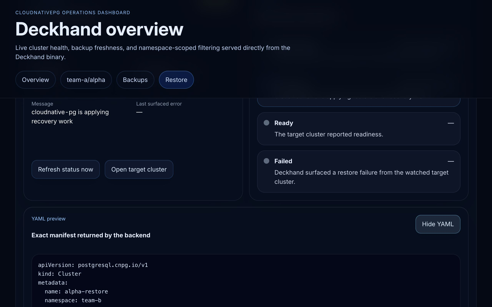
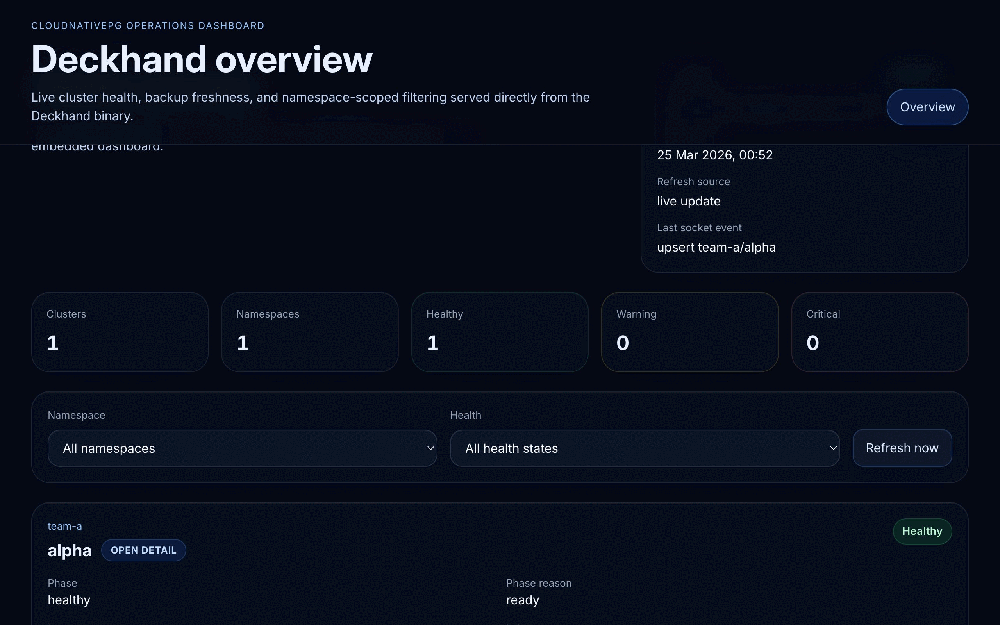

# Deckhand

[](go.mod)
[](web/package.json)
[](charts/deckhand/README.md)
[](LICENSE)

Deckhand is a day-2 operations dashboard for CloudNativePG. It ships as a single binary/container with an embedded React SPA, watches CNPG resources in Kubernetes, scrapes per-pod metrics, and exposes REST plus WebSocket surfaces for live cluster health, backup management, and guided restore workflows.

## Why Deckhand

- **Live CNPG visibility** — overview, detail, backup, and restore routes are powered by the current Kubernetes-backed runtime snapshot.
- **Backup and restore workflows** — trigger on-demand backups, inspect backup history, and create restore target clusters from the UI.
- **Truthful live updates** — the frontend listens on `/ws` and refetches authoritative API routes instead of trusting optimistic client state.
- **Single-pod packaging** — the Helm chart installs one Deployment that serves both the API and the embedded SPA.
- **Least-privilege RBAC** — the chart supports cluster-wide and namespace-scoped installs with the same resource matrix.

## Launch tour

### Overview dashboard


### Guided restore workflow



### Demo GIF



## Quick start

### Install with Helm

Cluster-wide install:

```bash
helm install deckhand charts/deckhand
```

Namespace-scoped install:

```bash
helm install deckhand charts/deckhand \
  --set rbac.clusterWide=false \
  --set "rbac.namespaces={production,staging}"
```

What you get:

- `ClusterRole`/`ClusterRoleBinding` for cluster-wide installs, or per-namespace `Role`/`RoleBinding` objects for scoped installs
- a single Deckhand pod serving the API, WebSocket endpoint, and embedded SPA on port `8080`
- namespace filtering via `DECKHAND_NAMESPACES` in scoped mode

For chart details and RBAC mode notes, see [`charts/deckhand/README.md`](charts/deckhand/README.md).

## Local development

### Build the shipped binary

```bash
make build
```

That target runs the frontend build first, embeds `web/dist`, and then produces the `deckhand` binary from `./cmd/deckhand`.

### Run the full test suite

```bash
make test
```

### Frontend-only iteration

Install dependencies once:

```bash
npm --prefix web ci
```

Run the Vite dev server:

```bash
npm --prefix web run dev
```

By default, Vite proxies `/api` and `/ws` to `http://127.0.0.1:8080`. Override that with `DECKHAND_DEV_BACKEND` if your backend runs elsewhere.

### Backend runtime

Deckhand needs either in-cluster credentials or an explicit kubeconfig path.

```bash
go run ./cmd/deckhand --kubeconfig "$KUBECONFIG" --listen 127.0.0.1:8080
```

Useful runtime flags and env vars:

- `--listen` / `DECKHAND_LISTEN` — HTTP listen address
- `--kubeconfig` / `KUBECONFIG` — kubeconfig path for local runs
- `--namespaces` / `DECKHAND_NAMESPACES` — comma-separated namespace scope

## What Deckhand exposes

- `GET /healthz` — health check
- `GET /api` — version document
- `GET /api/clusters` — overview list with namespace filter support
- `GET /api/clusters/{namespace}/{name}` — cluster detail summary
- `GET /api/clusters/{namespace}/{name}/metrics` — per-instance metrics snapshot
- `GET|POST /api/clusters/{namespace}/{name}/backups` — history plus on-demand backup creation
- `GET|POST /api/clusters/{namespace}/{name}/restore` — restore options plus restore creation
- `GET /api/clusters/{namespace}/{name}/restore-status` — restore progress for the target cluster
- `GET /ws` — change-notification stream used for live refetches

Need request/response examples or RBAC details? Jump straight to the published references:

- [`docs/api.md`](docs/api.md) for the REST + WebSocket contract and example payloads
- [`docs/permissions.md`](docs/permissions.md) for the exact Helm RBAC matrix and install-mode behavior

## Documentation map

- [Architecture overview](docs/architecture.md)
- [API reference](docs/api.md)
- [Permissions and RBAC](docs/permissions.md)
- [Releasing](docs/releasing.md)
- [Contributing guide](CONTRIBUTING.md)
- [Helm chart README](charts/deckhand/README.md)

## Project layout

```text
cmd/deckhand/           main entrypoint and runtime wiring
internal/api/           REST handlers, DTOs, and WebSocket hub
internal/k8s/           Kubernetes bootstrap, watchers, backup/restore creators
internal/metrics/       CNPG metrics scraping and health evaluation
internal/store/         in-memory runtime snapshot and change events
web/                    embedded React SPA and frontend tests
charts/deckhand/        Helm packaging and RBAC modes
```

## Contributing

See [CONTRIBUTING.md](CONTRIBUTING.md) for the current Go, Node, Make, and Helm workflow used in this repository.

## License

Deckhand is licensed under the [Apache License, Version 2.0](LICENSE).
