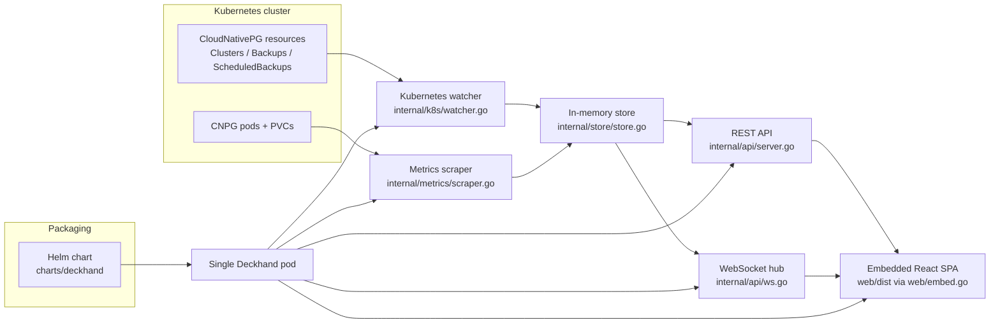

# Deckhand architecture

Deckhand packages a CloudNativePG operator-facing API and UI into a single deployable unit. The backend watches CNPG resources, stores a redacted in-memory runtime snapshot, scrapes per-pod metrics, exposes REST and WebSocket surfaces, and serves an embedded React SPA from the same process.

## System map

## Runtime flow

### 1. Startup wiring

`cmd/deckhand/main.go` is the runtime entrypoint. It:

1. parses `--listen`, `--kubeconfig`, and `--namespaces`
2. bootstraps Kubernetes clients and scheme registration
3. creates the in-memory store
4. starts the CNPG watcher
5. starts the metrics scraper
6. starts the WebSocket hub
7. mounts REST routes plus the embedded SPA and begins serving HTTP

The startup sequence is intentionally observable in logs with messages such as:

- `deckhand starting`
- `kubernetes runtime ready`
- `cnpg watcher ready`
- `metrics scraper ready`
- `websocket hub ready`
- `starting HTTP server`

## Core components

### Kubernetes watcher

`internal/k8s/watcher.go` registers controller-runtime informers for:

- `Cluster`
- `Backup`
- `ScheduledBackup`

Each add/update/delete event is normalized into store mutations and emits a `store.ChangeEvent` with:

- resource kind
- action (`upsert` / `delete`)
- namespace
- name
- UTC timestamp

### In-memory store

`internal/store/store.go` is the runtime truth cache. It keeps deep-copied snapshots of CNPG resources by namespace/name and lets subscribers listen for redacted change events. There is no persistent database in the current packaged architecture.

### Metrics scraper

`internal/metrics/scraper.go` periodically:

- lists clusters from the in-memory store
- resolves pod IPs and PVC capacity through the Kubernetes API
- scrapes per-pod CNPG exporter metrics
- computes cluster and instance health summaries
- stores typed results in an in-memory cache for the API layer

This is why Deckhand needs read access to Pods and PVCs in addition to CNPG resources.

### REST API

`internal/api/server.go` mounts:

- `GET /healthz`
- `GET /api`
- `GET /api/clusters`
- `GET /api/clusters/{namespace}/{name}`
- `GET /api/clusters/{namespace}/{name}/metrics`
- `GET|POST /api/clusters/{namespace}/{name}/backups`
- `GET|POST /api/clusters/{namespace}/{name}/restore`
- `GET /api/clusters/{namespace}/{name}/restore-status`
- `GET /ws`

DTOs in `internal/api/types.go` intentionally redact raw CRDs, pod IPs, and sensitive diagnostics before data reaches the browser.

### WebSocket invalidation stream

`internal/api/ws.go` subscribes to the store and broadcasts redacted `store.changed` events over `/ws`. The frontend uses these events as invalidation hints, then refetches the relevant REST endpoints to keep the UI authoritative.

### Embedded SPA

The React app lives in `web/src`. `make build` or the Docker build compiles it to `web/dist`, and `web/embed.go` embeds that directory into the Go binary. At runtime, non-API/non-WS routes fall back to `index.html`, so the same Deckhand pod serves both the API and the routed SPA.

## UI route model

The shipped UI currently exposes four operator-facing routes:

- `/` — cluster overview
- `/clusters/:namespace/:name` — cluster detail
- `/clusters/:namespace/:name/backups` — backup management/history
- `/clusters/:namespace/:name/restore` — guided restore workflow

Each route surfaces live-status cards and explicit error states so operators can tell whether they are seeing fresh data, a reconnecting socket, or an API failure.

## Packaging model

The Helm chart under `charts/deckhand/` packages Deckhand as a **single Deployment**. The same pod hosts:

- Kubernetes watchers
- metrics scraping
- backup/restore mutation logic
- REST endpoints
- WebSocket notifications
- the embedded React SPA

The chart supports two RBAC modes:

- **cluster-wide** — one `ClusterRole` and `ClusterRoleBinding`
- **namespace-scoped** — one `Role` and `RoleBinding` per configured namespace

## Operational notes

- Deckhand can run cluster-wide or against a namespace allowlist through `DECKHAND_NAMESPACES`.
- The current architecture is stateless beyond in-memory caches; restarting the pod rebuilds state from Kubernetes and fresh scrapes.
- The browser never receives raw pod IPs; diagnostics are redacted in API DTO assembly.
- The WebSocket channel carries change metadata, not full object payloads.

## Related docs

- [README](../README.md)
- [API reference](api.md)
- [Permissions and RBAC](permissions.md)
- [Helm chart README](../charts/deckhand/README.md)
